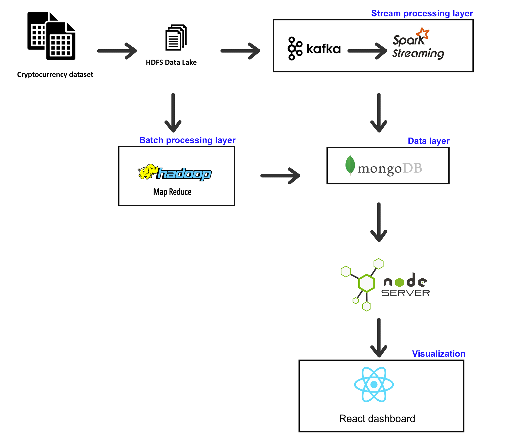

# Big Data Cryptocurrency Project

This project showcases a big data processing pipeline for cryptocurrency data using Hadoop, Spark Streaming, Kafka, MongoDB, and a React dashboard. The dataset used for this project is a CSV file of cryptocurrency data obtained from [ Kaggle G-Research Crypto Forecasting](https://www.kaggle.com/competitions/g-research-crypto-forecasting/data). The main goal of this project is to create a pipeline to process the dataset using a batch processing layer and a streaming processing layer, simulation the daily cryoptocurrency trade.

## Table of Contents

- [Data Pipeline](#data-pipeline)
- [Dataset](#dataset)
- [Batch Processing Layer](#batch-processing-layer)
- [Streaming Layer](#streaming-layer)
- [Data Storage and Visualization](#data-storage-and-visualization)
- [Demo](#demo)

## Data Pipeline

The following image shows our pipeline's architecture:

## Dataset

The dataset contains the following fields:

- `timestamp`: A timestamp for the minute covered by the row.
- `Asset_ID`: An ID code for the cryptoasset.
- `Count`: The number of trades that took place this minute.
- `Open`: The USD price at the beginning of the minute.
- `High`: The highest USD price during the minute.
- `Low`: The lowest USD price during the minute.
- `Close`: The USD price at the end of the minute.
- `Volume`: The number of cryptoasset units traded during the minute.
- `VWAP`: The volume weighted average price for the minute.
- `Target`: 15-minute residualized returns.

## Technologies Overview

This section provides a brief overview of the technologies used in this project and their role in big data processing.

- **HDFS (Hadoop Distributed FileSystem)**: HDFS is a distributed file system designed to store and manage large volumes of data across multiple nodes. It provides high-throughput access to data and is fault-tolerant, making it suitable for big data projects.

- **Hadoop**: Hadoop is an open-source framework that enables distributed storage and processing of large datasets using the MapReduce programming model. It provides a scalable, cost-effective solution for processing big data.

- **Spark Streaming**: Apache Spark Streaming is a robust, scalable, and fault-tolerant streaming processing system that inherently supports both batch and real-time workloads. As an extension of the core Spark API, Spark Streaming enables data engineers and data scientists to process live data from a variety of sources, such as Kafka, Flume, and Amazon Kinesis...

- **Kafka**: Apache Kafka is a distributed streaming platform that is designed to handle high-throughput, fault-tolerant, and scalable real-time data streaming. It enables the publishing and subscribing to streams of records and allows the processing of these streams as they occur. In this project, Kafka is used as a message broker to ingest and distribute the streaming data to be later processed by Spark Streaming.

- **MongoDB**: MongoDB is a NoSQL database that stores data in flexible, JSON-like documents, which allows for a more dynamic and scalable data model compared to traditional relational databases. It is designed to handle high-throughput, horizontal scaling, and high availability, making it well-suited for big data projects. In this project, MongoDB is used as the primary data store for the output of both batch processing and streaming data, providing a unified storage solution that simplifies data management and retrieval.

## Batch Processing Layer

In the batch processing layer, Hadoop MapReduce is used to process the daily batch of cryptocurrency trade data stored in HDFS for each cryptoasset ID.

## Streaming Layer

In the streaming layer, Apache Spark Streaming is used to process the streaming data. Spark Streaming consumes the data from the Kafka topic, simulating real world streamed data, and visualizes the variation of the volume weighted average price, the min, the max, and the count for every timestamp (minute).

## Data Storage and Visualization

The data is then stored in a MongoDB database and sent through a Node server to be visualized on a React dashboard.

## Demo
[demo.webm](https://github.com/SamerBenMim/BigData-Pipeline-Hadoop-Kafka-Spark/assets/79151541/5fb26869-e5dd-4378-9705-b82489e1e458)

